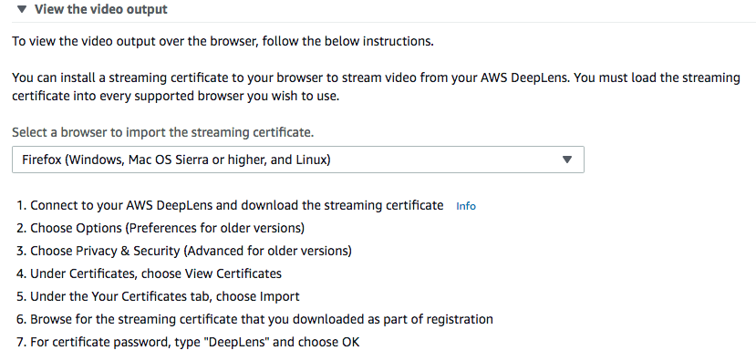

## Register AWS DeepLens

Visit [AWS Management Console](https://console.aws.amazon.com/console/home?region=us-east-1). Make sure you are on US-East (N.Virginia) region.

Search for DeepLens in the search bar and select AWS DeepLens to open the console.

On the AWS DeepLens console screen, find the Get started section on the right hand side and select Register Device.

### Step 1- Provide a name for your device.

Enter a name for your DeepLens device (for example, “MyDevice”), and select Next.

### Step 2- Provide permissions

AWS DeepLens projects require different levels of permissions, which are set by AWS Identity and Access Management (IAM) roles. When registering your device for the first time, choose **Create roles** under Permissions to have the required IAM roles created. 

Then choose **Next**

### Step 3- Download certificate
In this step, you will download and save the required certificate to your computer. You will use it later to enable your DeepLens to connect to AWS.

Select Download certificate and note the location of the certificates.zip file. Note: Do not open the zip file. You will attach this zip file later on during device registration.

Select **Continue.**

## Configure your DeepLens

In this step, you will connect the device to a Wi-Fi/Ethernet connection, upload the certificate and review your set-up. Then you're all set!

Power ON your device

 
If you are connected over monitor setup 

  
  Make sure the middle LED is blinking. If it is not, then use a pin to reset the device. The reset button is located at the back of the device
  
 Navigate to the setup page by choosing **Complete the setup** 
 
 
  

  

 
If you are connected in headless mode 

  
  Make sure the middle LED is blinking. If it is not, then use a pin to reset the device. The reset button is located at the back of the device
  
  Locate the SSID/password of the device’s Wi-Fi. You can find the SSID/password on the underside of the device.
  
  Connect to the device network via the SSID and provide the password
  
  Navigate to the setup page by choosing **Complete the setup** 
  
  
  

### Step 4- Connect to your network

Select your local Wi-Fi network ID from the dropdown list and enter your WiFi password. If you are using ethernet, choose Use Ethernet option instead.

Select Save.

If this is your first time registering the device, you will see the updates available screen. Choose **Install and Reboot** It will take couple of minutes for the updates to come through. After the updates are installed, the device will reboot automatically

On rebooting, the device will come back to the install and reboot screen. From the URL, delete the #softwareUpdate

### Step 5- Attach Certificates

Select Browse in the Certificate section. Select the zip file you downloaded in Step 4 

Select Next.

### Step 6- Download Streaming Certificate

Choose **Download** . Then choose **Next**

### Step 7- Device set up.

If you are on the device summary page- Please do not make changes to the password.

Note: Instead, if you are presented with the below screen, type the device password as Aws2017! . 

### Step 7- Select Finish

Congratulations! You have successfully registered and configured your DeepLens device. To verify, return to [AWS DeepLens console](https://console.aws.amazon.com/deeplens/home?region=us-east-1#projects) and select **Devices** in the left side navigation bar and verify that your device has completed the registration process. You should see a green check mark and Registered under Registration status.

## Deploy Face Recognition project

### Step 1- Create Project

The console should open on the Projects screen, select Create new project on the top right (if you don’t see the project list view, click on the hamburger menu on the left and select Projects)

Choose, Use a **project template** as the Project type, and select **Face Detection** from the project templates list.

Scroll down the screen and select **Next**

Change the Project name as Face-detection-your-name

Scroll down the screen and select **Create**

### Step 2- Deploy to device
In this step, you will deploy the Face detection project to your AWS DeepLens device.

Select the project you just created from the list by choosing the radio button

Select Deploy to device.

On the Target device screen, choose your device from the list, and select **Review.**

Select Deploy.

On the AWS DeepLens console, you can track the progress of the deployment. It can take a few minutes to transfer a large model file to the device. Once the project is downloaded, you will see a success message displayed and the banner color will change from blue to green.

## View Output

 
If you are connected over monitor setup 

  
 **Option 1: View over mplayer**
 
To view the output, open a terminal (on the desktop, choose the top left button and search for terminal) and enter the following command:

`mplayer -demuxer lavf -lavfdopts format=mjpeg:probesize=32 /tmp/results.mjpeg`
 
**Option 2: View over browser**

Step 1- From the left navigation, Choose Devices. Choose your device. Choose View Output

Step 2- Choose Firefox browser for Windows and Mac. Follow the instructions

Step 3- Open a browser tab and navigate to https://0.0.0.0:4000

View output and enjoy!

 
If you are connected over headless mode 

 
 Step 1- From the left navigation, Choose Devices. Choose your device. Choose View Output

Step 2- Choose your browser. Follow the instructions

Step 3- Click on **View stream**

View the output and enjoy!

